# ハンズオン内容
## 0. ハンズオン準備
本ハンズオンではGitHub Codespacesにコンテナ(`devcontainer`)として検証環境を作成し、その環境を利用します。  
ハンズオンで使用するコマンド等はあらかじめ`devcontainer`に含まれているため、以下の手順を実施することで必要な検証環境を用意することができます。  
(今回`devcontainer`の定義は[こちら](https://github.com/k8s-meetup-novice/devcontainer-custom-image/tree/main/images/src/gcloud-terraform/.devcontainer)のものを使用しています。)

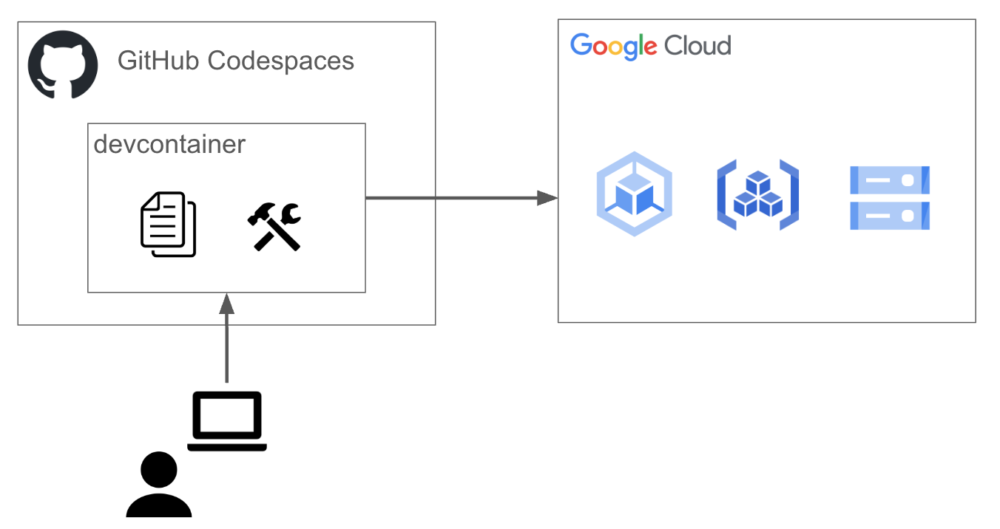

#### 参考
- [GitHub Codespaces](https://docs.github.com/ja/codespaces/about-codespaces/what-are-codespaces)
- [開発コンテナーの概要](https://docs.github.com/ja/codespaces/setting-up-your-project-for-codespaces/adding-a-dev-container-configuration/introduction-to-dev-containers)
- [DEV CONTAINERS](https://code.visualstudio.com/docs/devcontainers/containers)


### 0-1. codespaceの起動
左上のボタンをクリックし、「`Codespaces`」をクリックします。

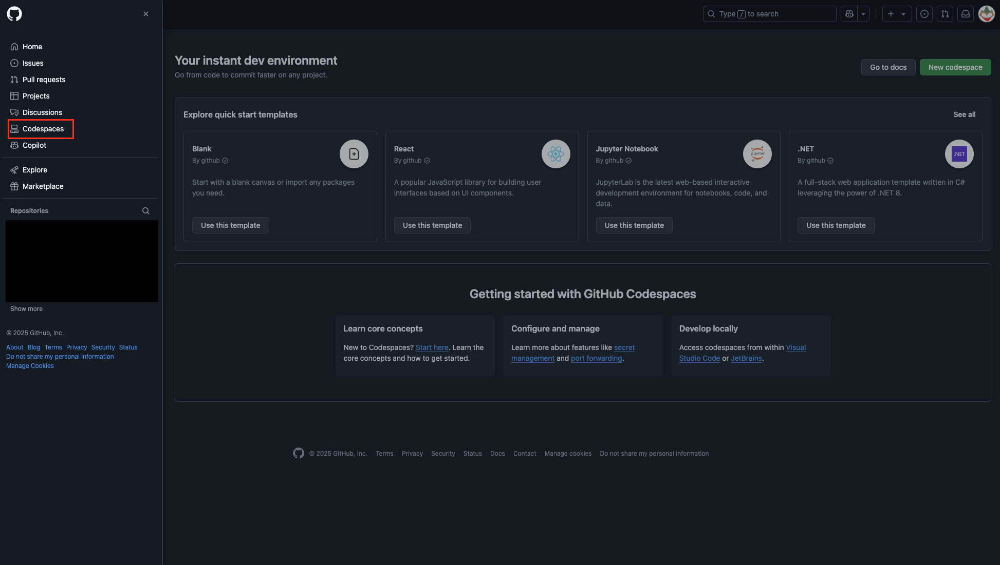


「`New codespace`」をクリックします。

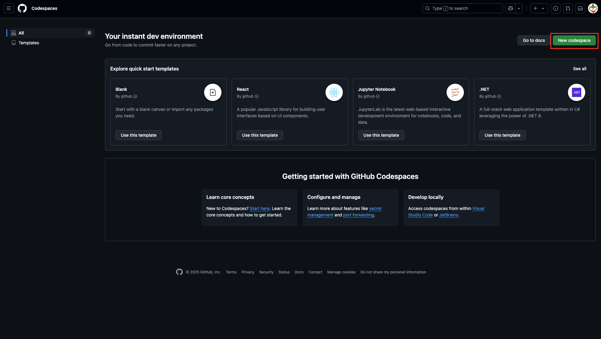


`Repository`にて

```
k8s-meetup-novice/gke-handson-20250508
```

を選択し、「`Create codespace`」をクリックします。

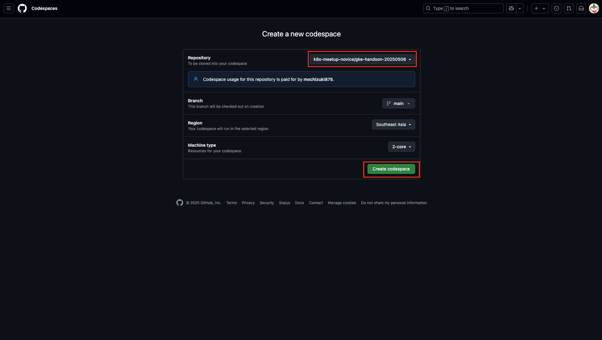

以下のように開発環境(VSCode)が表示されます。

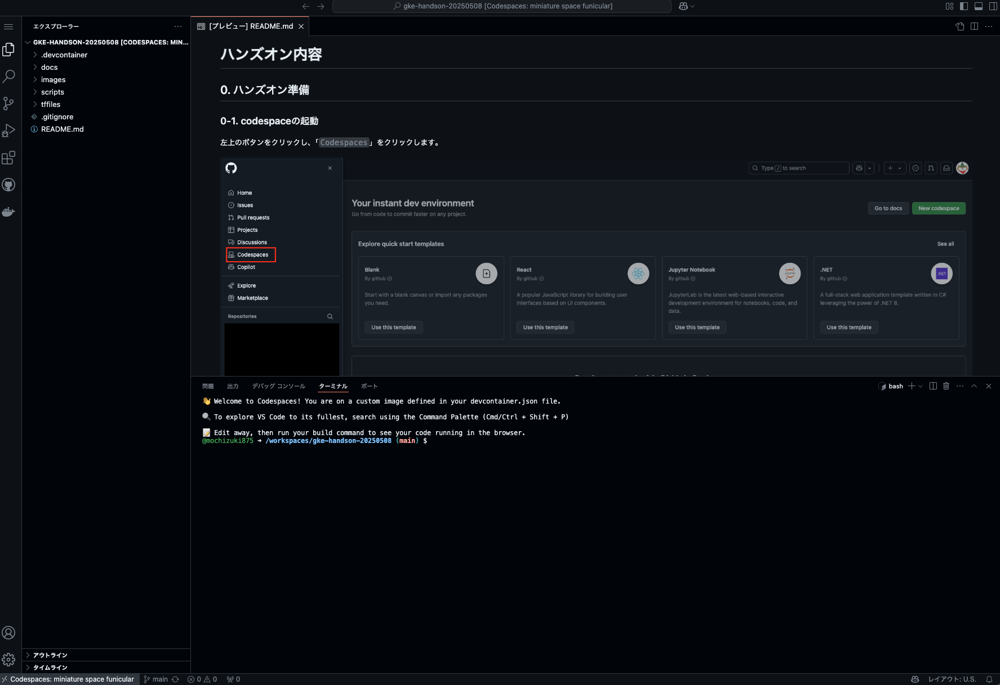


### 0-2. gcloud CLIの初期化
codespaceからGoogle Cloudにアクセスできるようにするため、[gcloud CLIの初期化](https://cloud.google.com/sdk/docs/initializing?hl=ja)を行います。

以下のコマンドを実行し、表示されたURLにWebブラウザからアクセスします。
```bash
gcloud init --no-launch-browser
```
```bash
Welcome! This command will take you through the configuration of gcloud.

Your current configuration has been set to: [default]

You can skip diagnostics next time by using the following flag:
  gcloud init --skip-diagnostics

Network diagnostic detects and fixes local network connection issues.
Checking network connection...done.                                                                                                                                                                                                                             
Reachability Check passed.
Network diagnostic passed (1/1 checks passed).

You must sign in to continue. Would you like to sign in (Y/n)? Y  # <--- Yを入力してEnter

Go to the following link in your browser, and complete the sign-in prompts:

    https://accounts.google.com/o/oauth2/auth?response_type=xxxxxxxxxx  # <--- ここに表示されたURLをコピーしてWebブラウザからアクセス

Once finished, enter the verification code provided in your browser: 
```

ログイン画面が教示されるため、Gooleアカウントを入力し「次へ」を押下します。
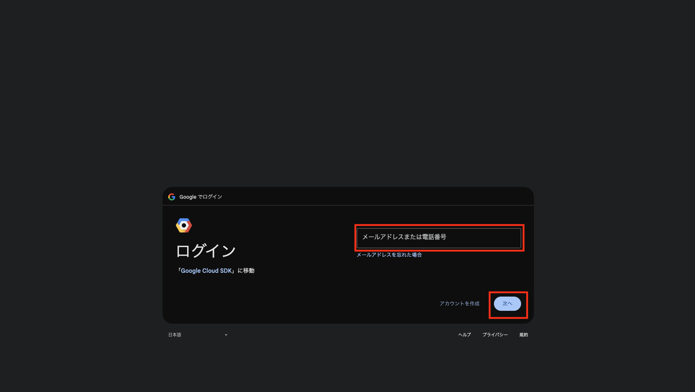

パスワードを入力し「次へ」を押下します。
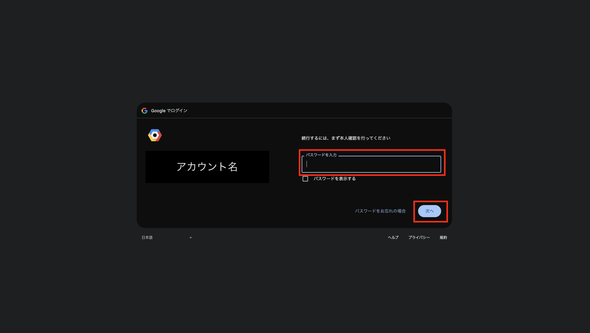

「次へ」を押下します。
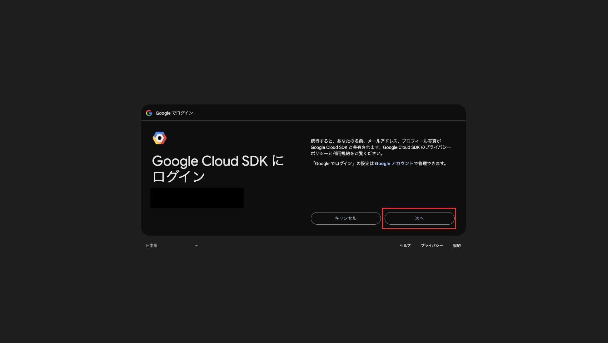

「許可」を押下します。
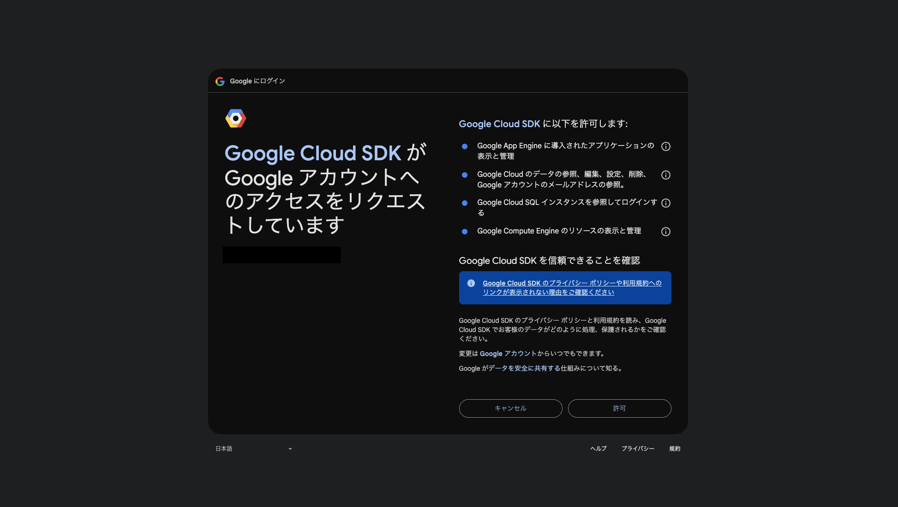

認証コードが表示されるため、これをコピーしてターミナルに戻り、ペーストします。
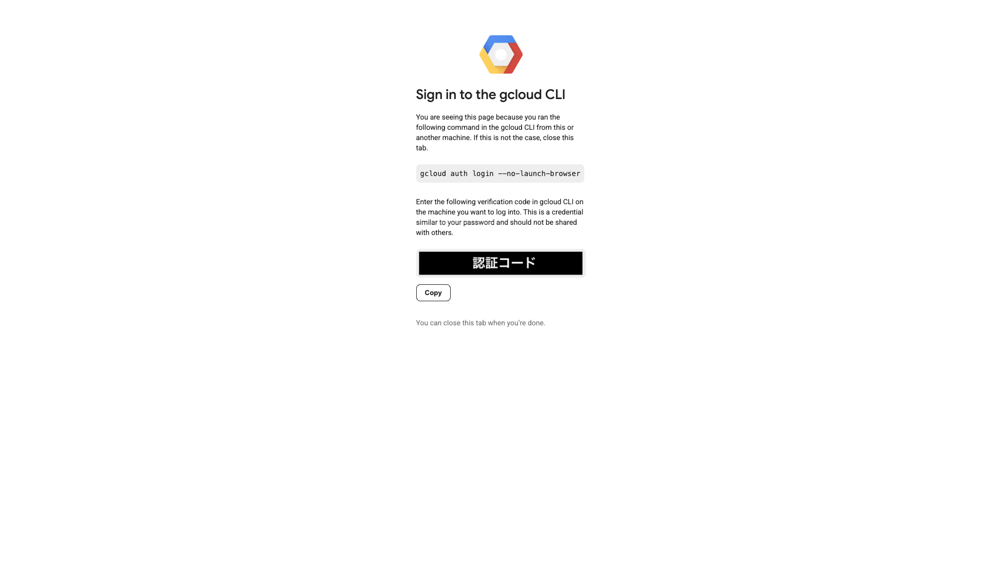

また、今回のハンズオン環境はQwiklabを使用おりあらかじめプロジェクトが作成されているため、以下のように既に作成済のプロジェクトを選択します。
(Qwiklab以外の環境を使用してハンズオンを実施する場合は[こちら](./docs/create-new-project.md)を参考にハンズオン用のプロジェクトを作成してください。)
```bash
Go to the following link in your browser, and complete the sign-in prompts:

    https://accounts.google.com/o/oauth2/auth?response_type=xxxxxxxxxx

Once finished, enter the verification code provided in your browser: xxxxxxx   # <--- ここに認証コードをペーストしてEnter

You are signed in as: [<Googleアカウント名>].

Pick cloud project to use: 
 [1] qwiklabs-gcp-xxxxxxx  
 [2] qwiklabs-resources
 [3] Enter a project ID
 [4] Create a new project
Please enter numeric choice or text value (must exactly match list item):  1 # <--- 1を入力してEnter

Your current project has been set to: [qwiklabs-gcp-xxxxxxx].

Your project default Compute Engine zone has been set to [asia-northeast1-a].
You can change it by running [gcloud config set compute/zone NAME].

...
```


### 0-3. プロジェクトIDの確認
以下のコマンドを実行し、現在gcloudコマンドに設定されているプロジェクトを確認します。

```bash
gcloud config list
```
```bash
...
project = qwiklabs-gcp-xxxxxxx
...
```


以下のコマンドを実行し、ハンズオンに使用するプロジェクトの`PROJECT_ID`と`PROJECT_NUMBER`を確認します。  
※`PROJECT_ID`はプロジェクトを識別するためのグローバルに一意なIDです。([参考](https://cloud.google.com/resource-manager/docs/creating-managing-projects?hl=ja))

```bash
gcloud projects list
```
```bash
PROJECT_ID           NAME                   PROJECT_NUMBER
<PROJECT_ID>         qwiklabs-gcp-xxxxxxx   <PROJECT_NUMBER>
...
```

### 0-4. 環境変数の設定
以下のコマンドを用いて、環境変数を設定します。

```bash
export GCLOUD_PROJECT_ID=<PROJECT_ID>
export GCLOUD_PROJECT_NUMBER=<PROJECT_NUMBER>
export GCLOUD_REGION=asia-northeast1
export CLUSTER_NAME=gke-wakaran-handson-cluster
export REPOSITORY_ID=gke-wakaran-handson-repository
export TF_VAR_project_id="${GCLOUD_PROJECT_ID}"
export TF_VAR_region="${GCLOUD_REGION}"
export TF_VAR_cluster_name="${CLUSTER_NAME}"
export TF_VAR_repository_id="${REPOSITORY_ID}"
```

以下のコマンドを実行し、正しく環境変数が設定されていることを確認します。
```bash
cat << EOF
GCLOUD_PROJECT_ID:      ${GCLOUD_PROJECT_ID}
GCLOUD_PROJECT_NUMBER   ${GCLOUD_PROJECT_NUMBER}
GCLOUD_REGION:          ${GCLOUD_REGION}
CLUSTER_NAME:           ${CLUSTER_NAME}
REPOSITORY_ID:          ${REPOSITORY_ID}
TF_VAR_project_id:      ${TF_VAR_project_id}
TF_VAR_region:          ${TF_VAR_region}
TF_VAR_cluster_name:    ${TF_VAR_cluster_name}
TF_VAR_repository_id:   ${TF_VAR_repository_id}
EOF
```

```bash
GCLOUD_PROJECT_ID:      <PROJECT_ID>
GCLOUD_PROJECT_NUMBER   <PROJECT_NUMBER>
GCLOUD_REGION:          asia-northeast1
CLUSTER_NAME:           gke-wakaran-handson-cluster
REPOSITORY_ID:          gke-wakaran-handson-repository
TF_VAR_project_id:      <PROJECT_ID>
TF_VAR_region:          asia-northeast1
TF_VAR_cluster_name:    gke-wakaran-handson-cluster
TF_VAR_repository_id:   gke-wakaran-handson-repository
```

### 0-5. サービスAPIの有効化
一般的にGoogle Cloudの各種サービスを利用する際は、あらかじめ[請求先アカウントをプロジェクトにリンク](https://developers.google.com/workspace/guides/create-project?hl=ja#gcloud-cli_1)した上で、利用する[サービスのAPIを有効化](https://cloud.google.com/endpoints/docs/openapi/enable-api?hl=ja)する必要があります。  
今回ハンズオンに使用するQwiklabでは、上記について既に実施済のため、改めて実施する必要はありません。  
Qwiklab以外の環境で実施する場合の手順は[こちら](./docs/enable_service_api.md)を参照してください。  


現在有効化されているサービスAPIの一覧は`gcloud services list`コマンドで確認できます。
以下のコマンドを実行し、今回使用する各サービスAPIが有効化されていることを確認します。
```bash
gcloud services list | grep -w compute.googleapis.com 
gcloud services list | grep -w container.googleapis.com
gcloud services list | grep -w iamcredentials.googleapis.com 
gcloud services list | grep -w artifactregistry.googleapis.com
gcloud services list | grep -w storage.googleapis.com
```

```bash
compute.googleapis.com              Compute Engine API
container.googleapis.com            Kubernetes Engine API
iamcredentials.googleapis.com       IAM Service Account Credentials API
artifactregistry.googleapis.com     Artifact Registry API
storage.googleapis.com              Cloud Storage API
```

## 1. Google Cloudリソースの作成
Terraformを使用してGKEクラスタ、Artifact Registry Repository, Cloud Storageをはじめとした各種Google Cloudリソースを作成します。

### 1-1. Terraformが使用する認証情報の作成
以下のコマンドを実行し、[TerraformからGoogle Cloudにアクセスするための認証情報を作成](https://cloud.google.com/docs/terraform/authentication?hl=ja)します。
コマンドを実行したら、`「0-2. gcloud CLIの初期化」`と同じ流れで認証を行います。

```bash
gcloud auth application-default login
```

以下のコマンドを実行し、Terraformを用いてGoogle Cloudリソースを作成します。(参考: [Terraform CLI](https://developer.hashicorp.com/terraform/cli/commands))

TerraformのIaCコードを含む`tffiles`ディレクトリに移動します。
```bash
cd tffiles
```

Terraformワークスペースの初期化を行います。
```bash
terraform init
```

Terraformの実行計画を確認します。
```bash
terraform plan
```

Terraformでリソースを作成します。
```bash
terraform apply
```

以下のように確認が求められるのでyesと入力します。
```bash
Do you want to perform these actions?
  Terraform will perform the actions described above.
  Only 'yes' will be accepted to approve.

  Enter a value: yes  # <--- yesと入力してEnter
```

コマンドの実行が正常に完了すると、以下のような結果が表示されます。(コマンドの実行には約10~15分程度要します。)
```bash
Apply complete! Resources: 8 added, 0 changed, 0 destroyed.

Outputs:

gke_cluster_endpoint = "X.X.X.X"
```


## 2. GKEへのアクセス

以下のコマンドを実行してGKEクラスタの認証情報を取得します。([参考](https://cloud.google.com/kubernetes-engine/docs/how-to/cluster-access-for-kubectl?hl=ja#install_plugin))
```bash
gcloud container clusters get-credentials $CLUSTER_NAME --region=$GCLOUD_REGION
```

以下のコマンドを実行してクラスタ情報が取得できることを確認します。
```bash
kubectl cluster-info
```

```bash
Kubernetes control plane is running at https://X.X.X.X
GLBCDefaultBackend is running at https://X.X.X.X/api/v1/namespaces/kube-system/services/default-http-backend:http/proxy
KubeDNS is running at https://X.X.X.X/api/v1/namespaces/kube-system/services/kube-dns:dns/proxy
Metrics-server is running at https://X.X.X.X/api/v1/namespaces/kube-system/services/https:metrics-server:/proxy

To further debug and diagnose cluster problems, use 'kubectl cluster-info dump'.
```

なお、今回構築したGKEクラスタでは[Autopilotモード](https://cloud.google.com/kubernetes-engine/docs/concepts/autopilot-overview?hl=ja)を使用しています。  
Autopilotモードではクラスタにデプロイされた[Pod](https://kubernetes.io/docs/concepts/workloads/pods/)などのワークロードに応じて、ワークロードの実行環境である[Node](https://kubernetes.io/docs/concepts/architecture/nodes/)の数やインスタンスタイプを最適化するため、現時点で`Node`数は0になっています。(`Node`があらかじめ作成されていることもあります。)

```bash
kubectl get nodes
```
```
No resources found
```


## 3. アプリケーションのデプロイ及びLBを用いた外部公開
GKEクラスタに`Pod`をデプロイし、`LoadBalancer`タイプの`Service`を用いて外部に公開します。

### 3-1. Podのデプロイ
`nginx`の`Pod`を作成します。
```bash
kubectl run nginx --image nginx -n default
```

しばらくすると`Pod`が正常に起動し、`STATUS`が`Running`であることを確認します。  
※初回は`Pod`が起動するまでに2分程度かかります。
```bash
kubectl get pods nginx
```
```
NAME    READY   STATUS    RESTARTS   AGE
nginx   1/1     Running   0          97s
```

また`Pod`をデプロイしたことで、Autopilotにより`Node`が1台起動していることが確認できます。
```bash
kubectl get nodes
```

```bash
NAME                                                  STATUS   ROLES    AGE   VERSION
gk3-gke-wakaran-handson-cluste-pool-x-xxxxxxxxxxxxx   Ready    <none>   97s   v1.32.2-gke.1182003
```

※Podを起動する際に時間を要したのは、初めて`Pod`をデプロイしたことにより`Node`の起動が発生したためです。

### 3-2. Serviceの作成と外部公開
次に作成した`nginx`の`Pod`に対して外部からアクセスするための[Service](https://kubernetes.io/docs/concepts/services-networking/service/)を作成します。  
ここではGKEクラスタ外部に`Pod`を公開するため、`LoadBalancer`タイプを指定することで`Service`に対応した`LoadBalancer`が作成されるように設定を行っています。  

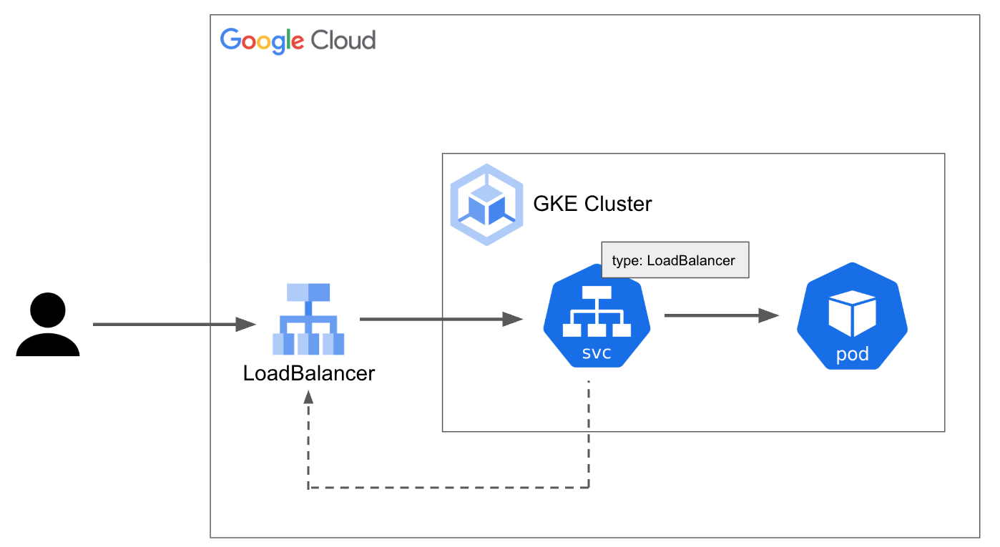

`scripts`ディレクトリに格納されている`service.yaml`マニフェストファイルを確認します。

`scripts/service.yaml`
```yaml
apiVersion: v1
kind: Service
metadata:
  name: nginx
spec:
  ports:
  - protocol: TCP
    port: 80
    targetPort: 80
  selector:
    run: nginx
  type: LoadBalancer
```

このマニフェストを適用すると、Kubernetesの`Service`が作成され、それに紐付く`LoadBalancer`([Network Load Balancer](https://cloud.google.com/load-balancing/docs/network/networklb-backend-service?hl=ja))が作成されます。

```bash
kubectl apply -f scripts/service.yaml
```

`kubectl`を用いて`Service`リソースを参照し、`EXTERNAL-IP`に表示されているIPアドレスを確認します。  
このIPアドレスが、`Service`を経由して外部から`Pod`にアクセスするための`LoadBalancer`のエンドポイントとなります。  
※`EXTERNAL-IP`が設定されるまでには少し時間がかかります。
```bash
kubectl get svc nginx
```

```bash
NAME    TYPE           CLUSTER-IP       EXTERNAL-IP      PORT(S)        AGE
nginx   LoadBalancer   X.X.X.X          <EXTERNAL_IP>    80:32500/TCP   54s
```

Google Cloudのコンソールから、`Load Balancer`が作成されていることを確認します。
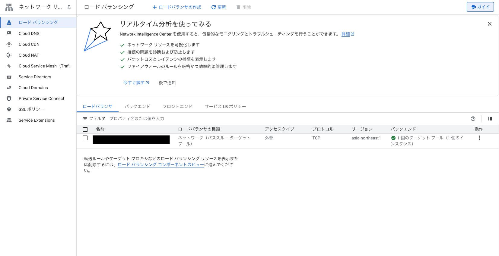


Webブラウザから`<EXTERNAL_IP>`にアクセスし、`nginx`の画面が表示されることを確認します。
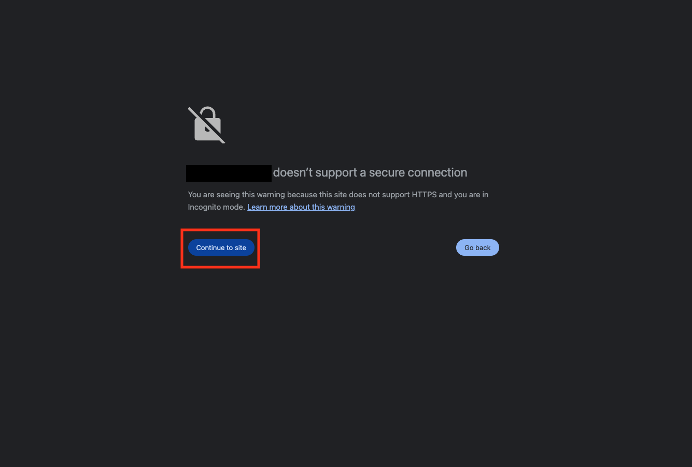
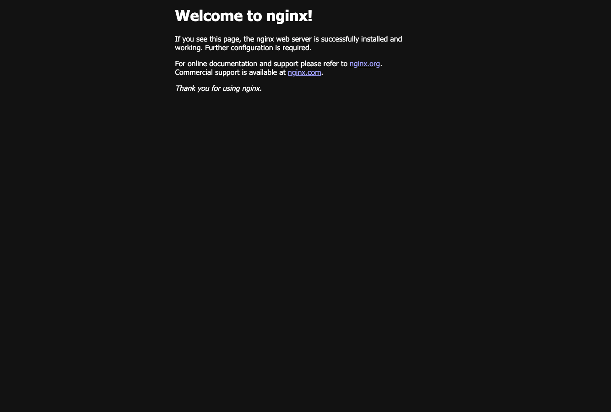


#### 参考
- [クラスタ外のネットワーキング](https://cloud.google.com/kubernetes-engine/docs/concepts/network-overview?hl=ja#outside-cluster)
- [LoadBalancer Service のコンセプト](https://cloud.google.com/kubernetes-engine/docs/concepts/service-load-balancer?hl=ja)
- [LoadBalancer タイプの Service の作成](https://cloud.google.com/kubernetes-engine/docs/how-to/exposing-apps?hl=ja#creating_a_service_of_type_loadbalancer)

## 4. Artifact Registryに格納したコンテナイメージの使用
Google Cloudが提供するパッケージマネージャーサービス[Artifact Registry](https://cloud.google.com/artifact-registry/docs?hl=ja)は、DockerHubのようなコンテナレジストリとして使用することができます。  
ここでは`Artifact Registry`に作成したリポジトリにコンテナイメージをアップロードし、GKEクラスタから利用します。

### 4-1. コンテナイメージのアップロード
[Docker Hub](https://hub.docker.com/_/nginx)から`nginx`のコンテナイメージを取得します。
```bash
docker pull nginx
```

環境変数にリポジトリパスを設定します。
```bash
export REPOSITORY_PATH="${GCLOUD_REGION}-docker.pkg.dev/${GCLOUD_PROJECT_ID}/${REPOSITORY_ID}"
```

正しく環境変数が設定されたことを確認します。
```bash
echo REPOSITORY_PATH:   ${REPOSITORY_PATH}
```
```bash
asia-northeast1-docker.pkg.dev/<PROJECT_ID>/gke-wakaran-handson-repository
```

Pullしたコンテナイメージに[イメージタグ](https://docs.docker.com/reference/cli/docker/image/tag/)を付与します。
```bash
docker tag nginx ${REPOSITORY_PATH}/gke-wakaran-handson-nginx:gke-waiwai
```

以下のコマンドを実行して、[リポジトリに対する認証](https://cloud.google.com/artifact-registry/docs/docker/pushing-and-pulling?hl=ja#auth)を行います。
```bash
gcloud auth configure-docker ${GCLOUD_REGION}-docker.pkg.dev
```
以下のように確認が求められるのでYと入力します。
```bash
Adding credentials for: asia-northeast1-docker.pkg.dev
After update, the following will be written to your Docker config file located at [/home/vscode/.docker/config.json]:
 {
  "credHelpers": {
    "asia-northeast1-docker.pkg.dev": "gcloud"
  }
}

Do you want to continue (Y/n)?  Y  # <--- Yと入力してEnter

Docker configuration file updated.
```

リポジトリにコンテナイメージをPushします。
```bash
docker push ${REPOSITORY_PATH}/gke-wakaran-handson-nginx:gke-waiwai
```

ここまでで`Artifact Registry`に作成したリポジトリへのコンテナイメージがアップロード完了しました。

Google Cloudのコンソールから、リポジトリにコンテナイメージが格納されていることを確認します。  
※`Artifact Registry`の確認は、検索ウィンドウで「`Artifact Registry`」を検索し、「`Artifact Registry`」を選択することで行えます。
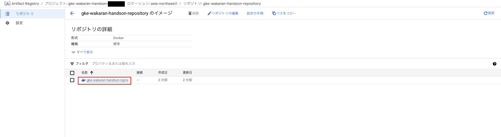

### 4-2. GKEクラスタからのコンテナイメージの利用
`Artifact Registry`のリポジトリにアップロードしたコンテナイメージから、GKEクラスタにPodをデプロイします。([参考](https://cloud.google.com/artifact-registry/docs/integrate-gke?hl=ja))  


以下のコマンド実行し、`Artifact Registry`のリポジトリにアップロードしたコンテナイメージを指定して`Pod`をデプロイします。
```bash
kubectl run nginx-from-artifact-registry --image ${REPOSITORY_PATH}/gke-wakaran-handson-nginx:gke-waiwai
```

`Pod`が正しくデプロイできたことを確認します。
```bash
kubectl get pod nginx-from-artifact-registry
```
```bash
NAME                           READY   STATUS    RESTARTS   AGE
nginx-from-artifact-registry   1/1     Running   0          2m20s
```

## 5. Workload Identity連携
GKEでは[Workload Identity連携](https://cloud.google.com/iam/docs/workload-identity-federation?hl=ja)と呼ばれる仕組みにより、Kubernetesの[ServiceAccount](https://kubernetes.io/docs/concepts/security/service-accounts/)にGoogle Cloudの`IAMロール`を紐付けることで、`Pod`からGoogle Cloudのサービスにアクセスすることができます。  
ここではこの仕組みを利用して、GKEにデプロイした`Pod`から`Cloud Storage`のバケットにアクセスします。  
なお、GKE Autopilotモードでは`Workload Identity連携`自体はデフォルトで有効化されているため、事前設定不要で`ServiceAccount`へのロールの紐付けを行うことができます。

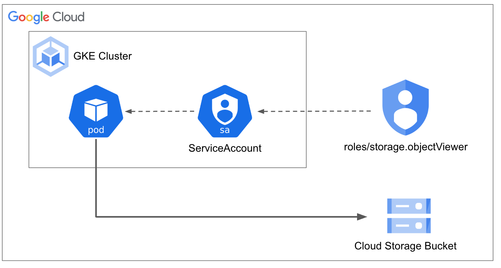

#### 参考
- [Workload Identity Federation for GKE について](https://cloud.google.com/kubernetes-engine/docs/concepts/workload-identity?hl=ja)
- [GKE ワークロードから Google Cloud APIs に対する認証を行う ](https://cloud.google.com/kubernetes-engine/docs/how-to/workload-identity?hl=ja)

### 5-1. Cloud Storageのバケットにファイルをアップロード
今回検証に用いるCloud Storageのバケットにテスト用ファイルをアップロードします。

Cloud Storageのバケット名を取得します。
```bash
STORAGE_BUCKET_NAME=$(gcloud storage buckets list --format="value(name)" | grep gke-wakaran-handson-bucket)
```

バケット名が環境変数に設定されていることを確認します。
```bash
echo STORAGE_BUCKET_NAME:   ${STORAGE_BUCKET_NAME}
```
```bash
STORAGE_BUCKET_NAME: gke-wakaran-handson-bucket-xxxxx
```

以下のコマンドを実行し、バケットにファイルをアップロードします。
```bash
touch test.txt
gcloud storage cp test.txt gs://${STORAGE_BUCKET_NAME}
```
```bash
Copying file://test.txt to gs://gke-wakaran-handson-bucket-bqfce/test.txt
  Completed files 1/1 | 0B 
```

以下のコマンドを実行し、バケットにファイルがアップロードできたことを確認します。
```bash
gcloud storage ls gs://${STORAGE_BUCKET_NAME}
```
```bash
gs://gke-wakaran-handson-bucket-bqfce/test.txt
```

### 5-2. ServiceAccountにロールを紐付けない場合
はじめに`ServiceAccount`にCloud Storageのオブジェクト参照権限を含むロールを紐付けない場合、Podからバケットにアップロードしたファイルが参照できないことを確認します。

`scripts`ディレクトリに含まれている`pod-before.yaml`というマニフェストを適用し、`Pod`をデプロイします。
```bash
kubectl apply -f scripts/pod-before.yaml 
```

`Pod`がデプロイされたことを確認します。
```bash
kubectl get pod pod-before
```
```bash
NAME         READY   STATUS    RESTARTS   AGE
pod-before   1/1     Running   0          47s
```

デプロイした`Pod`に接続します。
```bash
kubectl exec -it pod-before -- /bin/bash
```

以下のコマンドを実行してバケット内のオブジェクトを参照しようとすると、エラーとなり参照できないことが確認できます。  
※URLの`xxxxx`の部分はご自身のバケット名と同じ値に置き換えてください。
```bash
# Pod内で操作
curl -X GET -H "Authorization: Bearer $(gcloud auth print-access-token)" \
    "https://storage.googleapis.com/storage/v1/b/gke-wakaran-handson-bucket-xxxxx/o"
```
```bash
{
  "error": {
    "code": 403,
    "message": "Caller does not have storage.objects.list access to the Google Cloud Storage bucket. Permission 'storage.objects.list' denied on resource (or it may not exist).",
    "errors": [
      {
        "message": "Caller does not have storage.objects.list access to the Google Cloud Storage bucket. Permission 'storage.objects.list' denied on resource (or it may not exist).",
        "domain": "global",
        "reason": "forbidden"
      }
    ]
  }
```

`Pod`との接続を解除します。
```bash
# Pod内で操作
exit
```

### 5-3. ServiceAccountにロールを紐付けた場合
次に`ServiceAccount`にCloud Storageのオブジェクト参照権限を含むロール([storage.objectViewer](https://cloud.google.com/iam/docs/understanding-roles#storage.objectViewer))を紐付けた場合、Podからバケットにアップロードしたファイルが参照できるようになることを確認します。


以下のコマンドを実行し、`ServiceAccount`を作成します。
```bash
kubectl create serviceaccount gke-wakaran-handson-sa
```

`ServiceAccount`が作成されたことを確認します。
```bash
kubectl get serviceaccount gke-wakaran-handson-sa
```
```bash
NAME                     SECRETS   AGE
gke-wakaran-handson-sa   0         48s
```

[storage.objectViewer(Storage オブジェクト閲覧者)](https://cloud.google.com/iam/docs/understanding-roles#storage.objectViewer)というロールを`ServiceAccount`(`gke-wakaran-handson-sa`)に紐付けます。
```bash
gcloud storage buckets add-iam-policy-binding gs://${STORAGE_BUCKET_NAME} \
    --role=roles/storage.objectViewer \
    --member=principal://iam.googleapis.com/projects/${GCLOUD_PROJECT_NUMBER}/locations/global/workloadIdentityPools/${GCLOUD_PROJECT_ID}.svc.id.goog/subject/ns/default/sa/gke-wakaran-handson-sa \
    --condition=None
```
```bash
bindings:
- members:
  - projectEditor:<PROJECT_ID>
  - projectOwner:<PROJECT_ID>
  role: roles/storage.legacyBucketOwner
- members:
  - projectViewer:<PROJECT_ID>
  role: roles/storage.legacyBucketReader
- members:
  - projectEditor:<PROJECT_ID>
  - projectOwner:<PROJECT_ID>
  role: roles/storage.legacyObjectOwner
- members:
  - projectViewer:<PROJECT_ID>
  role: roles/storage.legacyObjectReader
- members:
  - principal://iam.googleapis.com/projects/<PROJECT_NUMBER>/locations/global/workloadIdentityPools/<PROJECT_ID>.svc.id.goog/subject/ns/default/sa/gke-wakaran-handson-sa
  role: roles/storage.objectViewer
etag: CAM=
kind: storage#policy
resourceId: projects/_/buckets/gke-wakaran-handson-bucket-xxxxx
version: 1
```


`scripts`ディレクトリに含まれている`pod-after.yaml`というマニフェストを適用し、Podをデプロイします。  
この`Pod`には先ほど`storage.objectViewer`というロールを付与した`ServiceAccount`が紐付けられています。
```bash
kubectl apply -f scripts/pod-after.yaml 
```

`Pod`がデプロイされたことを確認します。
```bash
kubectl get pod pod-after
```
```bash
NAME        READY   STATUS    RESTARTS   AGE
pod-after   1/1     Running   0          105s
```

デプロイした`Pod`に接続します。
```bash
kubectl exec -it pod-after -- /bin/bash
```

以下のコマンドを実行すると、バケット内のオブジェクトが参照できることが確認できます。  
※URLの`xxxxx`の部分はご自身のバケット名と同じ値に置き換えてください。
```bash
# Pod内で操作
curl -X GET -H "Authorization: Bearer $(gcloud auth print-access-token)" \
    "https://storage.googleapis.com/storage/v1/b/gke-wakaran-handson-bucket-xxxxx/o"
```
```bash
    "https://storage.googleapis.com/storage/v1/b/gke-wakaran-handson-bucket-bqfce/o"
{
  "kind": "storage#objects",
  "items": [
    {
      "kind": "storage#object",
      ...
      "name": "test.txt",
      "bucket": "gke-wakaran-handson-bucket-xxxxx",
      ...
    }
  ]
}
```

`Pod`との接続を解除します。
```bash
# Pod内で操作
exit
```

## 6. クリーンアップ
※本手順はQwiklabを使用している場合は実施不要です。

以下のコマンドを実行し、Terraformで作成した各種Google Cloudのリソースを削除します。
```bash
cd tffiles
terraform destroy
```

以下のように確認が求められるのでyesと入力します。
```bash
...
Do you really want to destroy all resources?
  Terraform will destroy all your managed infrastructure, as shown above.
  There is no undo. Only 'yes' will be accepted to confirm.

  Enter a value: yes    # <--- yesと入力してEnter
```

```bash
Destroy complete! Resources: 8 destroyed.
```


ハンズオン用に作成したプロジェクトを削除します。
```bash
gcloud projects delete $GCLOUD_PROJECT_ID
```